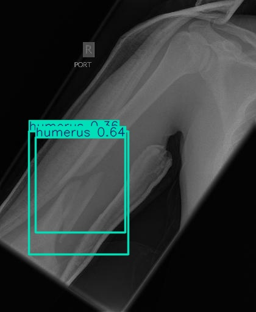

  
# AI-Powered Bone Fracture Detection

  

  <i>Advanced deep learning system for rapid and accurate bone fracture detection from X-ray images.</i>

## 📋 Overview

This is a state-of-the-art web application that uses artificial intelligence to help healthcare professionals identify bone fractures from X-ray images with high accuracy. The system leverages YOLOv8 deep learning models and provides visual explanations using Grad-CAM technology to enhance trust and interpretability.

---
## ✨ Key Features

- 🔍 **Advanced Detection**: Identifies various fracture types (transverse, oblique, spiral, comminuted, greenstick).
- ⚡ **Speed**: Processes X-ray images in under 2 seconds.
- 🔬 **Grad-CAM Visualization**: Shows exactly where the model is focusing, increasing clinical trust.
- 📊 **Detailed Analysis**: Provides confidence scores and explanations for each detection.
- 🌐 **Web Interface**: User-friendly frontend for easy image uploads and result viewing.
- 🔄 **API Access**: RESTful endpoints for integration with other clinical systems.

---
## 🖼️ Screenshots

  <table>
    <tr>
      <td><strong>Detection Results</strong></td>
      <td><strong>Grad-CAM Visualization</strong></td>
    </tr>
    <tr>
      <td></td>
      <td></td>
    </tr>
  </table>

---
## 🏗️ Architecture

It consists of two main components:

1.  **Backend (FastAPI)**: Handles image processing, runs the YOLOv8 model, and generates visualizations.
2.  **Frontend (HTML/CSS/JS)**: Provides user interface for uploading X-rays and viewing results.

---
## 🛠️ Technology Stack

- **Backend**: Python, FastAPI, PyTorch, Ultralytics YOLOv8, OpenCV
- **Frontend**: HTML5, CSS3, JavaScript, FontAwesome
- **AI Model**: YOLOv8 trained on bone fracture X-ray datasets
- **Visualization**: Grad-CAM (Gradient-weighted Class Activation Mapping)

---
## 📂 Project Structure

├── graphs/
│   ├── epochs_vs_accuracy.png
│   └── confusion_matrices/
├── models/
│   ├── yolo_model.py
├── backend/                # FastAPI backend
│   ├── app.py              # Main application file
│   ├── requirements.txt    # Backend dependencies
│   ├── models/             # YOLOv8 model files
│   ├── results/            # Detection results
│   │   ├── explanations/   # Model explanation images
│   │   └── gradcam/        # Grad-CAM visualization images
│   └── uploads/            # Uploaded X-ray images
│
├── frontend/               # Static web frontend
│   ├── index.html          # Home page
│   ├── detect.html         # Detection page
│   ├── gradcam.html        # Grad-CAM explanation page
│   ├── about.html          # About page
│   ├── features.html       # Features page
│   ├── team.html           # Team page
│   ├── contact.html        # Contact page
│   ├── styles.css          # Main stylesheet
│   └── images/             # Frontend images
│
├── requirements.txt        # Project dependencies
└── README.md               # Project documentation

---
## 🚀 Getting Started

### Prerequisites

- Python 3.8+
- pip (Python package manager)
- Modern web browser
